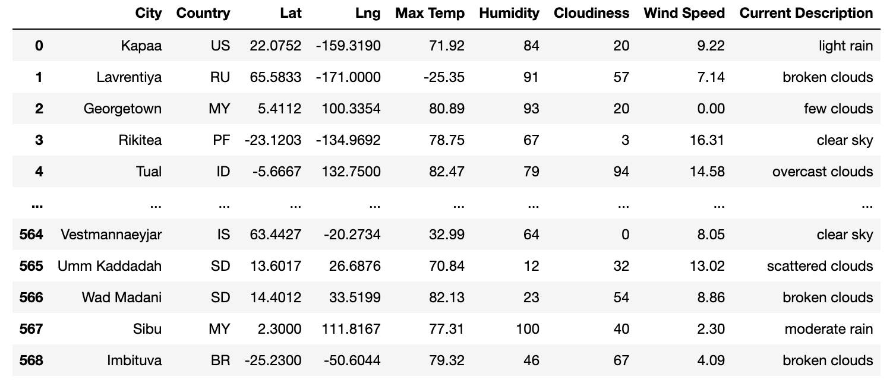
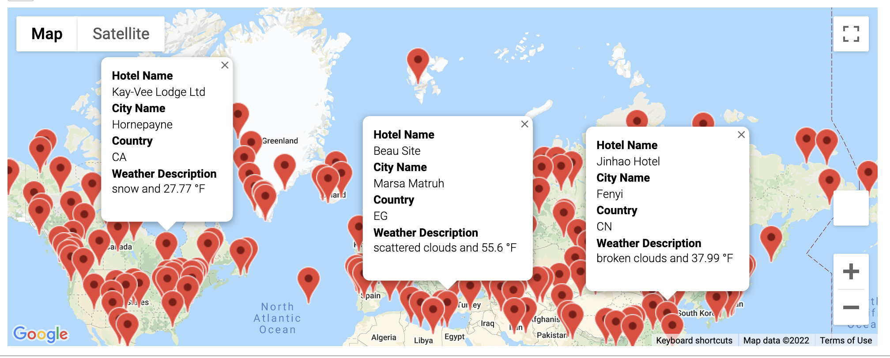
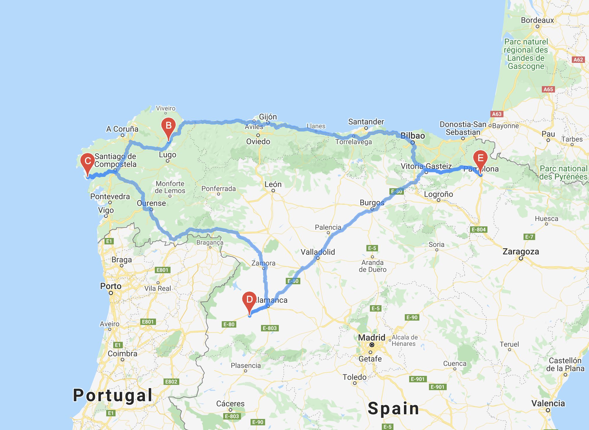
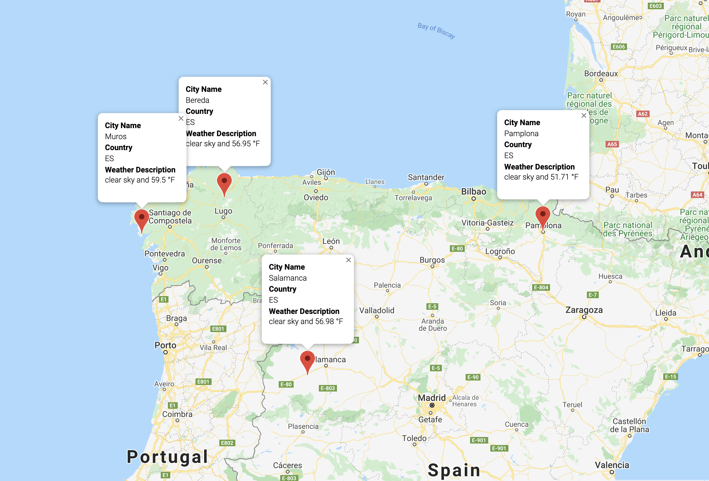

# World_Weather_Analysis

---

## Overview 

### Purpose

This project uses APIs from Google and Open Weather to optain random city location and weather information. The first part of this paper aims at collecting the city locations and weather information. The second part looks at obtaining hotel information for cities within a given min and max temperature, and provides a map with markers for each location. The third part focuses on creating a map of a suggested route plan for a trip, based off of 4 cities in the database.

### Aim

The 3 main aims for this paper are; 
  - Collect city and weather information 
  - Find hotels near city locations 
  - Create a route for 3 cities in the dataframe

---

## Results & Analysis

#### City and Weather Information

City and Weather Dataframe

 

Using an API key from Open Weather, a list of 625 random cities was created, with the help of Pandas a dataframe containing a list of cities and weather decriptions is created. 

 

#### Hotels

Hotels Map

 

Using the dataframe that was previously created, inputting chosen min and max temperatures, in this case -40 and 60, will pull back a list of cities. Using a Google API key and gmaps, a map, as seen above, is created showing hotels in cities falling into that range. 

 

#### Itinerary

Route Suggestion &nbsp; &nbsp; &nbsp; &nbsp; &nbsp; &nbsp; &nbsp; &nbsp; &nbsp; &nbsp; &nbsp; &nbsp; &nbsp; &nbsp; &nbsp; &nbsp; &nbsp; &nbsp; &nbsp; &nbsp; &nbsp; &nbsp; &nbsp; &nbsp; &nbsp; &nbsp;Hotel Suggestion 

 

---

## Summary
